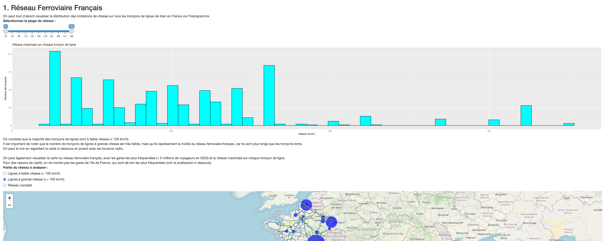

# DSIA_4101C Analyse des données de la SNCF

## Aperçu du projet

Ce projet est un projet d'analyse de données de la SNCF provenant de <https://ressources.data.sncf.com>. Il vise à explorer et analyser les données relatives aux lignes de train, à la fréquentation des gares, à la vitesse maximale sur les lignes.

## User Guide

### Clonage

Pour cloner le projet, exécutez la commande suivante :

```bash
git clone
````

### Dépendances

L'ensemble des packages R nécessaires au projet sont listés dans le fichier requirements.txt. Pour les installer, il suffit dans la console R de lancer la commande suivante pour chacun des packages :

```r
install.packages("nom_du_package")
```

Pour la partie python, qui consiste en la collecte, et le prétraitement des données, il est nécessaire d'installer les packages suivants avec python 3.12.5:

```bash
ipykernel==6.29.5
notebook==7.4.2
jupyter==1.1.1
numpy==2.2.6
pandas==2.2.3
geopandas==1.0.1
folium==0.19.6
branca==0.8.1
plotly==6.1.1
```

Pour les installer, vous pouvez utiliser pip :

```bash
pip install "nom_du_package"=="version" 
``` 

### Obtention des données

On peut obtenir les données en exécutant le script `get_data.py`. Ce script télécharge les données de la SNCF et les enregistre dans le répertoire `data/raw`. Le détail des provenances des données est disponible dans le fichier `data/provenance.md`.

```bash
python get_data.py
```

### Prétraitement des données

Le prétraitement des données est effectué dans le script `treat_data.py`. Ce script nettoie et prépare les données pour l'analyse. Il enregistre les données prétraitées qui sont nécessaires pour le dashboard dans le répertoire `data/processed`.

```bash
python treat_data.py
```

### Lancement du dashboard

Le dashboard peut être lancé en se mettant sur le fichier `app.py` dans RStudio, puis en exécutant dans la console R la commande suivante :

```r
library(shiny)
shiny::runApp()
```

Une fenêtre s'ouvrira si vous utilisez RStudio, ou bien vous devrez vous rendre à [http://localhost:3945](http://localhost:3945).

## Data

Les données brutes utilisées dans ce projet consistent en 7 fichiers. 5 d'entre eux proviennent de la SNCF, une de [data.gouv.fr](https://data.gouv.fr) et une du site de monsieur Courivaud. Le détail de la provenance des données est disponible dans le fichier `data/provenance.md`.
Elles sont disponibles dans le répertoire `data/raw` après exécution du script `get_data.py`.

Voici le détail des fichiers :

- `formes-des-lignes-du-rfn.geojson` décrit les formes des lignes du réseau ferré national (RFN). On peut s'en servir pour afficher les lignes sur une carte.
- `vitesse-maximale-nominale-sur-ligne.geojson` décrit les limites de vitesse sur les lignes du RFN.
- `liste-des-gares.geojson` décrit les gares du RFN, avec leur nom, leur code UIC, leurs coordonnées géographiques, etc.
- `frequentation-gares.csv` décrit la fréquentation des gares du RFN, avec le nombre de voyageurs par an entre 2015 et 2023.
- `emission-co2-perimetre-complet.csv` décrit les émissions moyennes de CO2 en fonction de différents trajets sur le RFN. On peput ainsi comparer les émissions de CO2 en fonction du moyen de transport utilisé (Avion, TGV, Voiture, etc.).
- `20230823-communes-departement-region.csv` décrit les communes, départements et régions de France. On peut s'en servir pour faire une jointure avec les données des gares pour trouver la région du'ne gare par exemple.
- `insee-pop-communes.csv` décrit la population des communes de France. On peut s'en servir pour faire une jointure avec les données des gares pour trouver la population de la ville où se trouve une gare.

## Exploration des données

L'exploration des données et la création de graphiques simples sont entièrement documentées dans les notebooks situés dans le répertoire `notebooks`. Ces notebooks sont au format Jupyter et peuvent être ouverts avec Jupyter Notebook ou Jupyter Lab.
Les notebooks sont numérotés dans l'ordre d'exécution. Ils permettent de mieux comprendre les choix faits notamment pour le prétraitement des données, ainsi que des premières versions des graphiques qui apparaissent dans le dashboard.

## Developer guide

La structure du projet est la suivante :

```bash
.
├── R
│   ├── covid.R
│   ├── global.R
│   ├── reseau.R
│   ├── server.R
│   └── ui.R
├── app.R
├── config
│   └── sources.json
├── data
│   ├── processed
│   │   ├── emissions.csv
│   │   ├── gares_communes.geojson
│   │   └── shapes_speeds.geojson
│   ├── provenance.md
│   └── raw
│       ├── 20230823-communes-departement-region.csv
│       ├── emission-co2-perimetre-complet.csv
│       └── ...
├── get_data.py
├── notebooks
│   ├── 1_shapes.ipynb
│   ├── 2_speeds.ipynb
│   ├── ...
│   └── tests.md
├── readme.md
├── requirements.txt
├── resources.md
├── src
│   └── data_processing_utils.py
└── treat_data.py
```

### Parties communes au projet de Python

Les données sont stockées dans le répertoire `data`. Les données brutes sont stockées dans le répertoire `data/raw` et les données traitées sont stockées dans le répertoire `data/processed`. Le fichier `config/sources.json` contient les sources des données, et les noms des fichiers.

Les notebooks sont stockés dans le répertoire `notebooks`. Ils sont numérotés dans l'ordre d'exécution. Ils permettent de mieux comprendre les choix faits notamment pour le prétraitement des données, ainsi que des premières versions des graphiques qui apparaissent dans le dashboard.
Le fichier `requirements.txt` contient les dépendances du projet. J'invite **fortement** à consulter ces notebooks qui constituent une part importante de la documentation du projet.

Le fichier `get_data.py` permet de télécharger les données brutes et de les stocker dans le répertoire `data/raw`. Le fichier `treat_data.py` permet de traiter les données brutes et de les stocker dans le répertoire `data/processed`.

Le fichier `src/data_processing_utils.py` contient les fonctions utilitaires pour le traitement des données. Il est appelé par le fichier `treat_data.py`.

### Parties spécifiques à R

#### `app.R`, `R/ui.R`, `R/server.R`, `R/global.R`

Le fichier principal du projet est `app.R` situé à la racine. Il fait appel aux fichiers `R/global.R`, `R/server.R` et `R/ui.R` pour la logique de l'application Shiny.

Le fichier `R/ui.R` contient la définition de l'interface utilisateur de l'application Shiny.

Le fichier `R/server.R` contient la logique de l'application Shiny, c'est-à-dire les fonctions qui sont appelées lorsque l'utilisateur interagit avec l'application. Les données sont modifiées et filtrées dans ce fichier, et les graphiques sont créés à partir des données filtrées.

Le fichier `R/global.R` contient les imports des packages nécessaires au projet, les appels aux modules contenant les fonctions de génération des graphiques, ainsi que la lecture des données traitées dans le répertoire `data/processed`.

#### `R/reseau.R`

Le fichier `R/reseau.R` contient les fonctions spécifiques à l'analyse et l'affichage des données du réseau et de l'affluence du réseau. Il est appelé par le fichier `R/server.R`.

Il utilise des fonctions pour générer les graphiques et la carte.

#### `R/covid.R`

Le fichier `R/covid.R` contient les fonctions spécifiques à l'analyse et l'affichage des données relatives aux effets de la pandémie du COVID sur l'affluence sur le réseau. Il est appelé par le fichier `R/server.R`.

Il utilise des fonctions pour générer les graphiques et la carte.

Si on souhaite ajouter de nouvelles fonctionnalités, je recommande soit d'ajouter de nouvelles fonctions dans les fichiers existants, puis de les appeler dans le fichier `R/server.R`, avant de les afficher dans le fichier `R/ui.R`, soit de créer de nouveaux fichiers dans le répertoire `R` et de les appeler dans le fichier `R/server.R`.

## Rapport d'Analyse

En ouvrant le dashboard, on tombe sur ça :



Le dashboard est divisé en 2 sections :

### 1. Réseau ferroviaire national

L'onglet "Réseau ferroviaire" fournit une analyse détaillée du réseau ferroviaire français. 

1. **Distribution des limitations de vitesse** :
    - Il s'agit d'un histogramme qui montre la distribution des limitations de vitesse sur les lignes du réseau ferré national. Il permet de visualiser les vitesses maximales autorisées sur les différentes lignes.

    On peut conclure que la majorité des lignes ont une vitesse inférieure à 160 km/h par rapport au reste. Mais cette conclusion est à nuancer, car le fait que la majorité des lignes ont une vitesse inférieure à 160 km/h ne signifie pas que la majorité du réseau est à cette vitesse. En effet, on ne prend pas en compte la longueur des lignes.

2. **Carte du réseau ferroviaire** :
   - La carte montre les lignes de train et la vitesse maximale sur chaque tronçon, ainsi que les gares les plus fréquentées (> 5 millions de voyageurs en 2023).
  
    On constate que les gares les plus fréquentées hors Paris sont Lyon Part-Dieu, Strasbourg-Ville, Lille-Flangres. Il s'agit de gares intermédiaires sur les lignes à grande vitesse (LGV) qui relient Paris aux grandes villes de province, ainsi qu'aux grandes lignes internationales.
    Les zones où le réseau est le moins exploité par les TGV sont le Massif Central, les Pyrénées, et le Grand Est.

3. **Répartition des gares à forte affluence** :
   - Un pie chart montre la répartition des gares les plus fréquentées en France en 2023 (> 5 M de voyageurs).

    On constate que l'Île-de-France concentre la majorité des gares les plus fréquentées, avec 83% des gares les plus fréquentées.

4. **Fréquentation en fonction de la population** :
   - Un scatterplot montre la relation entre la population des communes et la fréquentation des gares en 2023.

    On constate que malgré le fait qu'elles soient en moyenne moins peuplées, les gares de l'Île-de-France sont les plus fréquentées. On peut aussi constater que les gares des grandes villes de province sont également très fréquentées, malgré une population moins importante que celle de l'Île-de-France.

### 2. Évolution du nombre de voyageurs avec le temps (2015-2023)

L'onglet "Évolution du nombre de voyageurs" fournit une analyse de l'évolution du nombre de voyageurs dans les gares françaises entre 2015 et 2023.

1. **Évolution du nombre de voyageurs** :
   - Un line chart montre l'évolution du nombre de voyageurs dans les gares françaises entre 2015 et 2023, par région.

    On constate toujours que l'Île-de-France est la région la plus fréquentée ; On constate également que toutes les régions ont connu une baisse nette de fréquentation entre 2019 et 2020, due à la pandémie de COVID-19. La fréquentation a ensuite progressivement augmenté jusqu'en 2023. Certaines région ont plus souffert que d'autres de la pandémie.

2. **Impact du COVID-19 par région** :
   - Un bar chart montre les pertes relatives de voyageurs entre 2019 et 2020 par région. 

    On constate que la région Ile de France a perdu nettement plus de voyageurs proportionnellement que les autres régions. C'est dû à la nature de hub central de la région Île-de-France, et plus particulièrement des gares parisionnes, qui sont des points de passage obligatoires pour les voyageurs qui se déplacent en train entre les régions de province.

En conclusion, ce projet met en lumière l'importance du réseau ferroviaire français et l'impact de la pandémie de COVID-19 sur le transport ferroviaire.

## Copyright

Le déclare sur l’honneur que le code fourni a été produit par moi-même, excepté certaines lignes où la source est indiquée en commentaires.